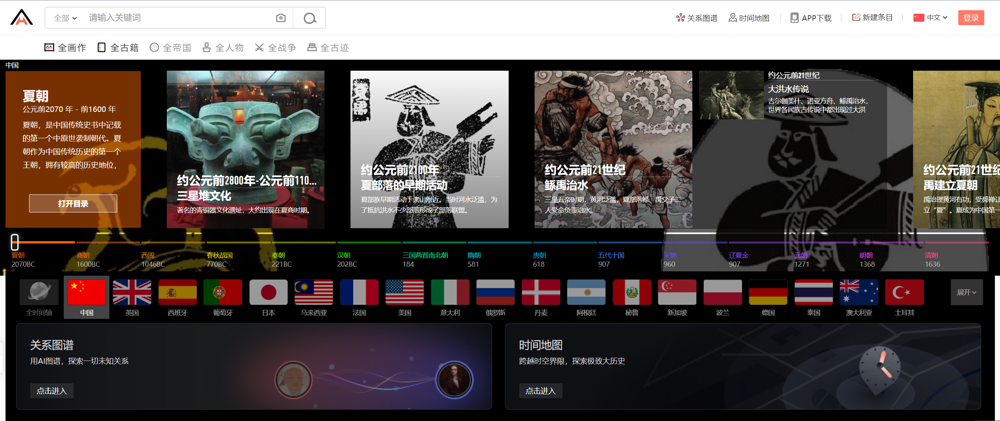
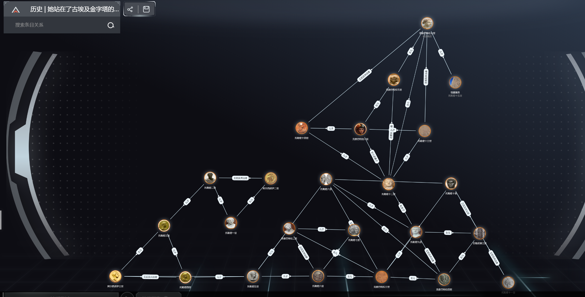
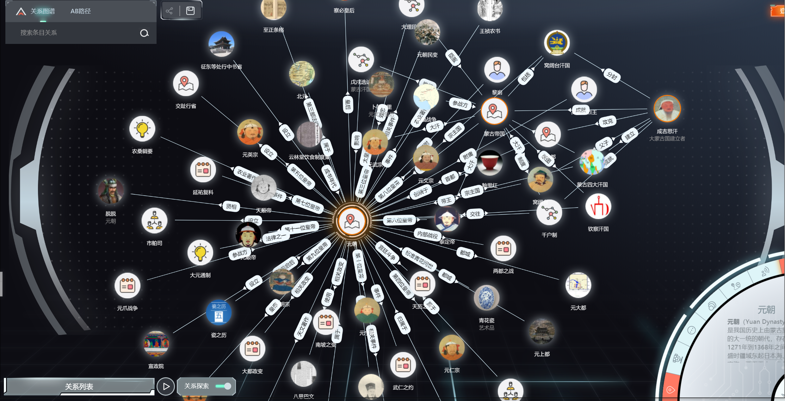

# 历史

历史能够鉴古今，这也是人们喜欢历史的原因，历史是丰富多彩而又充满神秘的东西，历史的长河既有错误也有成功。时间能够证明一切，我们能做的就是一点一点去揭开历史神秘的面纱，总有一天我们也会成为历史的一部分。

下面给大家推荐一个不错的历史整理网站(以后会慢慢增加)：

#### 全历史：<https://www.allhistory.com/>

相信有的人应该也可能看过，在这里面他根据历史的时间年轮从人类的起源到各个国家的创建发展进行了比较详细的解说，并且还配有图文解释。

更厉害的是他还加了一个关系图谱和空间地图

你可以通过你想了解的人物，通过关系图谱联系到所有跟他有关的人，挺有意思

比如你输入成吉思汗会显示出跟他相关的所有人物，事迹，成就等，大家可以亲自体验一下。感觉可以有助于锻炼发散思维家里有小孩的也许可以收藏一下。