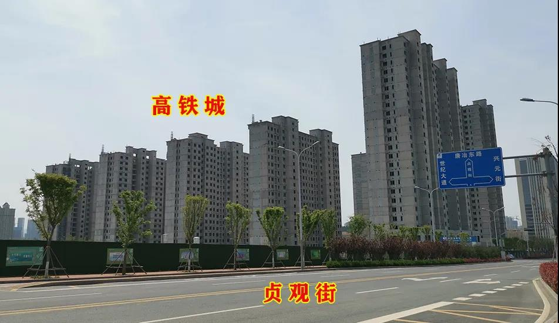

#济南楼市统计
​    范围是唐冶北半部分，即龙凤山路以东，围子山路以西，飞跃大道以南，世纪大道以北。
​    这个区域原先基本是“秃的”，现在已经被各大开发商满满当当的填补起来。

     唐冶热度仍在，但已经被张马片区、文旅城、公园九里、万象东方等等楼盘盖过了风头。
     就像最近的万象东方，10999起的价格赚足了眼球，虽然位置很靠北，但人家距离东站确实近，而且有万象新天打下的基础，再加上价格的吸引，开盘去化估计不错。 
     相反，唐冶虽然楼盘很多，但是最近没有“炒作”的点！买房人气相对不旺！

>1、==山钢锦悦华府==，楼都封顶了，正式的营销中心还没有见到，可谓沉得住气。

>2、==玖唐府==，精装，高层面积117㎡，价格14500-15500元/㎡；小高层面积128㎡三室，145㎡四室，均价15500-16000元/㎡。

>3、==鲁能泰山7号==，在售3期西地块，精装房，高层15500元/㎡，小高层17500元/㎡，价格保持的不错，奈何销售不出彩。据各种消息，已经证实鲁能泰山7号即将推出三期东地块毛坯房源，面积96㎡、108㎡、116㎡、126㎡，预计价格11000+

>4、==龙湖九里晴川==，高层房源已售罄。主力产品为6层叠墅，上叠面积169㎡，价格360万/套；中叠330㎡，价格550万/套；
    下叠298㎡，620万/套；预计2021年年底交房；63-174㎡商铺，均价28000元/㎡，预计2021年6月交房。

>5、==保利和唐悦色==，4层双层叠拼别墅，毛坯，上叠面积145㎡，价格360-500万/套；下叠面积223㎡，价格430-500万/套。

>6、==鲁坤天鸿创谷==，起价6666元/㎡，均价7600元/㎡，在售B7地块2-3#楼，为19层精装公寓，面积32㎡、44㎡、57㎡。

>7、==海潮汇==，平层公寓毛坯交房，面积35㎡、46㎡，价格7500-8500元/㎡，预计2021年6月交房；
    loft公寓精装交房，面积50㎡、67㎡、82㎡、96㎡，价格10500元/㎡，预计2022年1月、7月分批次交房；
    在售45-350㎡底商，一层均价28000元/㎡，公摊18%，二层13000元/㎡，公摊27%，一拖二20000元/㎡，2021年6月/年底交房。
    商业别墅同时在售，上叠135㎡，赠送129㎡，带屋顶花园，价格180-200万/套；下叠面积152㎡，最大赠送237㎡，带双院，价格300-320万/套。

>8、==新城悦隽风华==，4月17日加推7＃楼，共104套毛坯房源。
    7＃楼，26层，户型面积为102平方米、128平方米，开盘当天去化12套，均价10700元/㎡。
    另外131㎡小高层在售，价格13000-13500元/㎡。

>9、==万科翡翠山语==，精装房源在售，小高层面积108㎡、111㎡，均价16500元/㎡；
    高层面积110㎡、130㎡，均价15500元/㎡。
    叠拼别墅面积165-380㎡，毛坯交房，总价390万/套—650万/套。
    
>10、==远洋天著春秋==，4层叠拼别墅，产权面积200-300㎡，价格400-600万/套；
    11层洋房，1梯2户，面积118㎡三室、133㎡、143㎡四室，精装交房，价格14800元/㎡起。
    合院别墅300-500㎡，价格800-1500万/套。

>11、==龙湖景粼原著==，180㎡跃层，共12层，2层一户，总价290万/套起。
    大平层面积129㎡、176㎡、177㎡、179㎡、188㎡、295㎡，价格17000-20000元/㎡。
    别墅面积400-550㎡，价格1000-1600万/套。

>12、==高铁城==，精装，小高层面积98㎡、120㎡、130㎡、150㎡、180㎡，均价约16000元/㎡；
    高层面积103㎡、130㎡，均价约14500元/㎡。

唐冶目前在售楼盘的竞争也是很激烈的，相似类型产品很多，除去别墅、叠墅产品，基本均为精装销售。
新城悦隽（jun）风华刚推出104套毛坯房，仅去化12套，可谓惨淡。此项目的位置靠近唐冶东北，位置不占优势。
==鲁能7号率先做出改变，推出3期毛坯房，据传，价格在11000+==。如果真是这样，估计会吸引很多购房者，毕竟鲁能7号配备自己的商业、离着地铁口也近，且有学校配套，各方面来讲还是很有优势的。

**唐冶片区虽然最近“炒”不动了，但是前期奠定的基础还是不错的。**

>==商业***==有已开业的奥特莱斯，未开业的鲁能贵和、鲁商广场、帝华广场等。

>==教育***==有历城二中高中、稼轩中学私立、唐冶中学；唐冶小学、兴元小学、易安小学、明睿小学等等，幼儿园的配置也不在少数。唐冶新区对于教育这一板块很是投入。

>==交通***==方面经十路、世纪大道、飞跃大道是东西向的三条主干道。片区内开通社区公交，也有通往市区的公交。但随着交房楼盘越来越多，公交目前仍是短板。

其实每个片区都有各自的优势、劣势，每个楼盘也有优缺点。对于购房者而言，首先要明确自身的购房需求

   ***不要人云亦云。套用一句老话：适合自己的才是最好的！***
