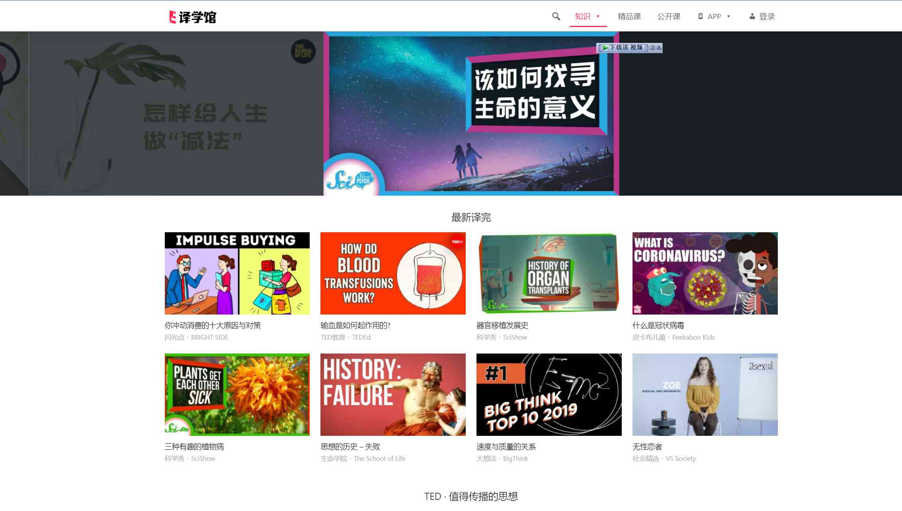
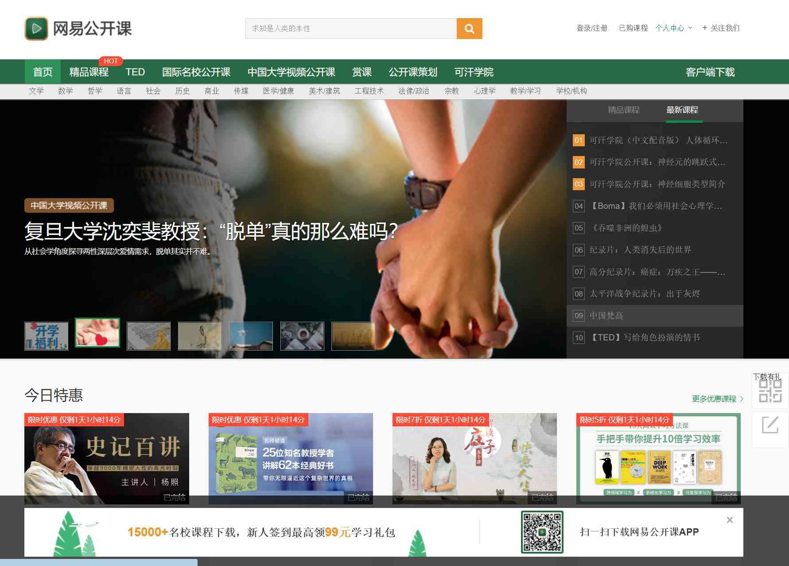
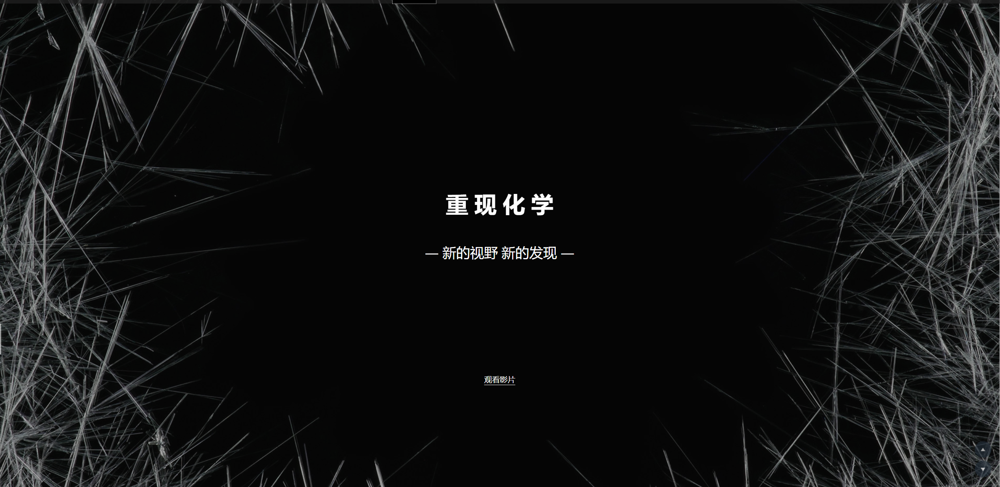
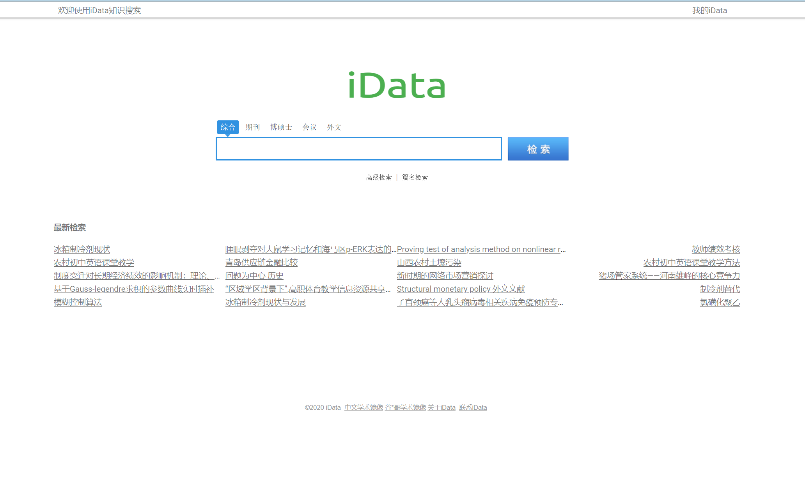
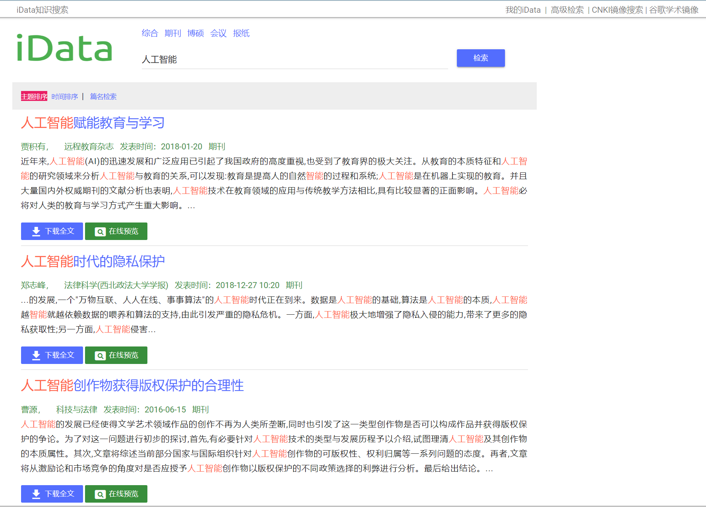
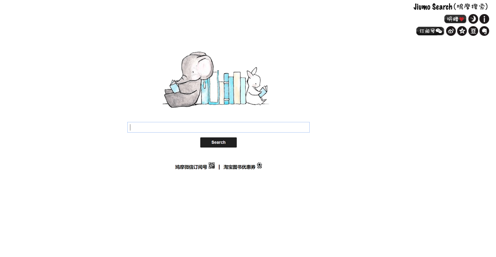
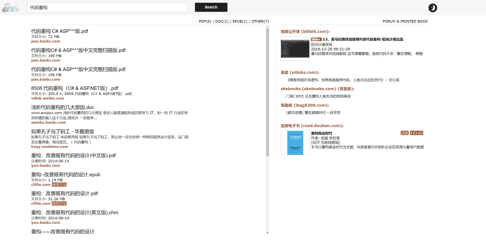
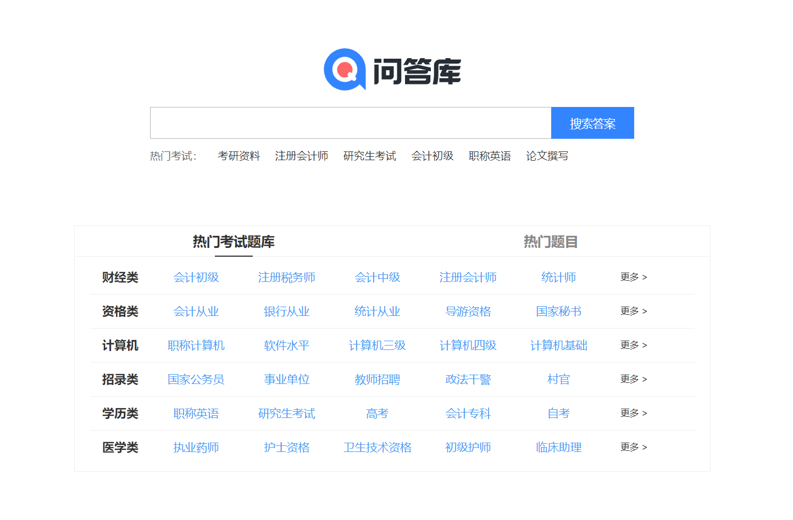
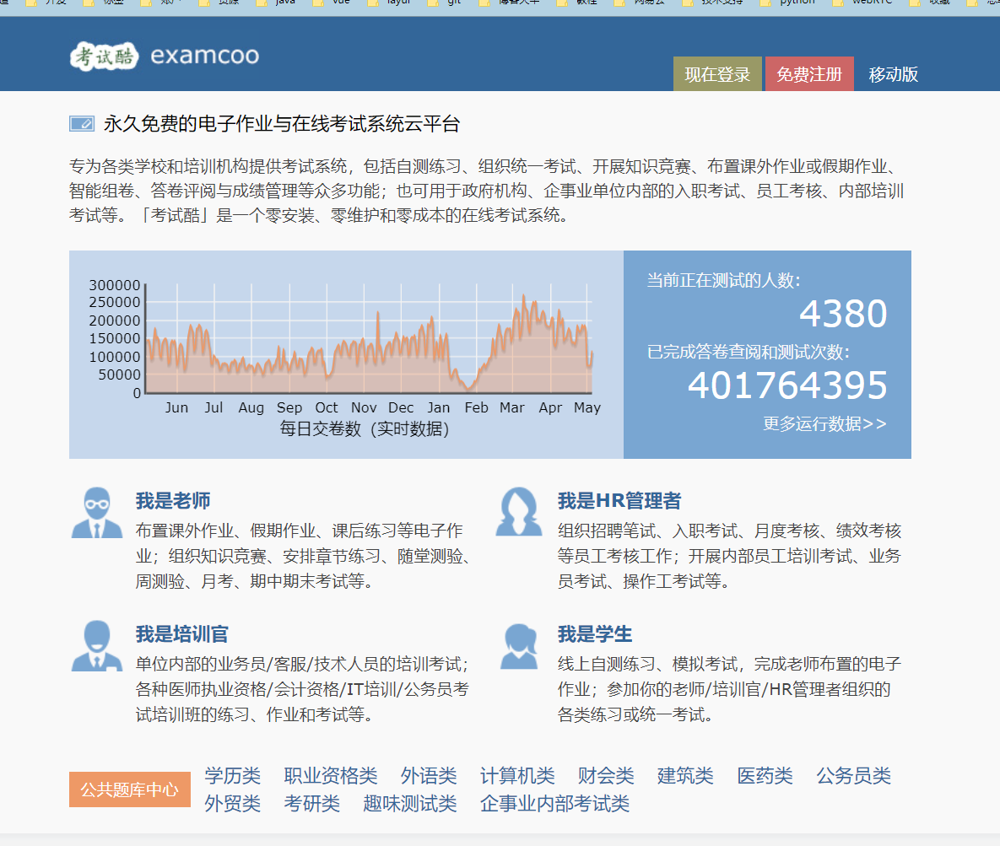

# 学习

### 译学馆：<https://www.yxgapp.com>

**译学馆**与下面的**网易公开课**，两者基本形式差不多。都是一些名讲对一些问题做了一些深刻并且科学的讲解和分析，让你更好的理解这个世界和事物。希望大家能在这上面找几篇不错课程先看看，了解下。

### 网易公开课：<https://open.163.com>

### 重 现 化 学: <https://www.envisioningchemistry.cn>

一个化学知识的创意网站，把一些化学反应通过微观拍摄成视频展示出来，很震撼也让你更零距离的去感受化学反应的美与细微变化。化学老师可以引用一下这上面的一些视频在上实验课的时候给学生看一下，也许能更增强学生的学习热情。

### IData: <https://www.cn-ki.net>

一个类似知网或者万方数据库的论文查询下载的网站，支持在线浏览跟下载文档。只需要注册一下即可，功能还算齐全各种检索方式等，也可以链接知网和谷歌学术检索。

### Jiumo Search 鸠摩搜索 - 文档搜索引擎: <https://www.jiumodiary.com>

现在大家平时可能很少有买书的习惯了，但是还是有读书的需求但却不想去买书，所以很多人手里都有个纸墨屏的读书设备像kindle啥的，然后你就可以下载相应的数据进行阅读还方便携带。该网站通过大数据搜索，把你要查询的书籍信息，包含了各种格式有txt、pdf、mobi、epub(这几个应通过kindle都能打开，或者借助相应的阅读软件)通过搜索后给你找到对应的下载链接或者分享地址，然后你下载导入你的相应设备上阅读即可。

### 问答库: <https://www.asklib.com>

做最有用的题库问答学习平台，如果你正在为备考一些职称，证书什么的该网站能帮你解释一些相应的问题，并有对应的解析等，对应的有财经类、资格类、计算机、招录类、学历类、医学类等相关内容。

### 考试酷(examcoo): <https://examcoo.com>

 
专为各类学校和培训机构提供考试系统，包括自测练习、组织统一考试、开展知识竞赛、布置课外作业或假期作业、智能组卷、答卷评阅与成绩管理等众多功能；也可用于政府机构、企事业单位内部的入职考试、员工考核、内部培训考试等。「考试酷」是一个零安装、零维护和零成本的在线考试系统。网站上还有各个种类的考试试题，对于正在或者准备考证或者提升的你来说，可以试试在上面找找相应的考试题测试测试也不错。
