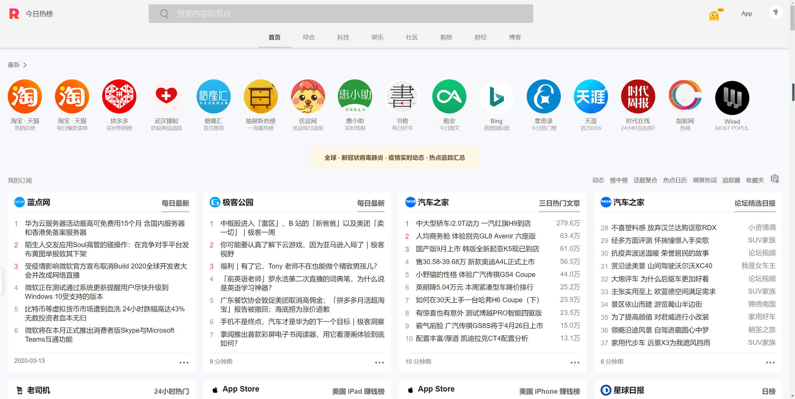
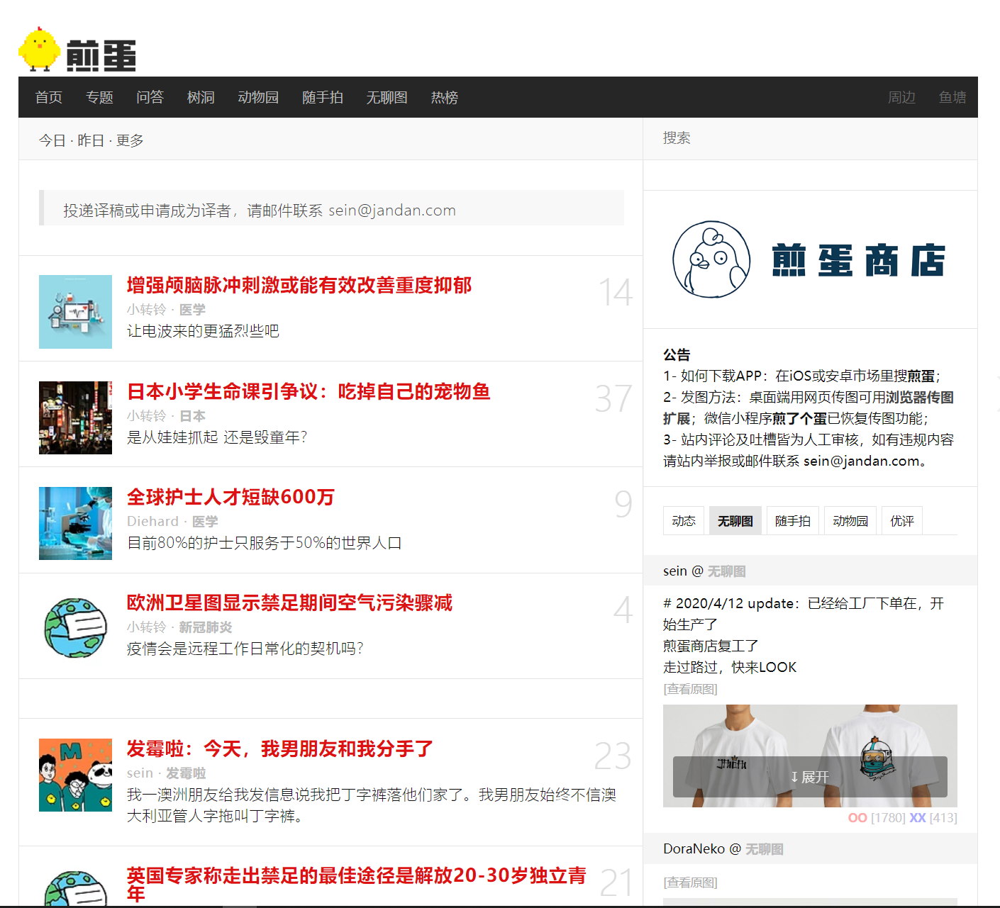
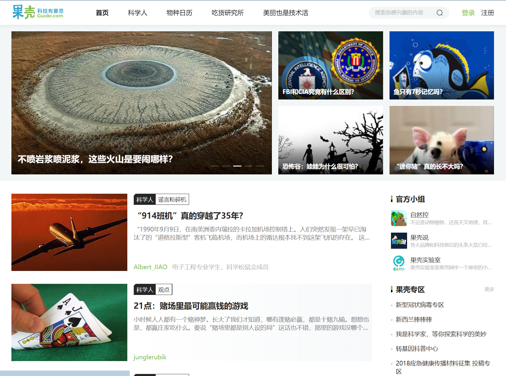

# 新闻

现在随着网络技术迅速的发展，加上手机的广泛普及，无论在世界的哪一个角落发生什么，只要大家还在同一个地球村，都能够迅速的了解到发生了什么，因为每个人的手机上都安装了各种各样的新闻app，有什么新闻都会随时推送给你。那么多的新闻app每一个都下载似乎会很累赘，所以今天给大家推荐几个集各种新闻消息于一体的一些网址供大家使用(后续也会慢慢增加)：

今日热点：<https://tophub.today/>

网站上基本上涵盖了你手机上安装的所有有关新闻类的app，推送的消息也基本上都是一些热门，还算可以，阅读起来还算方便

### 煎蛋：<http://jandan.net/>

也是一个挺有趣的信息网站，会有好多人投稿去分享一些科普或者小故事类的新闻跟故事，虽然有贴吧或者微博之类的地方，但是那几个地方说实话太咋，太乱啥都有，在这里或许你能发现不一样的故事和收获。

### 果壳<科技有意思>：<https://www.guokr.com/>

这个基本上就纯是一个给科普的了，涉猎了很多领域，也很有意思，大家可以看一下，应该比刷抖音或者快手可能有新引力(只不过没有漂亮的小姐姐)，但是你可以通过你了解的知识，去给你的小姐姐去科普哦，这样啥都有了ε=(･д･｀*)ﾊｧ…