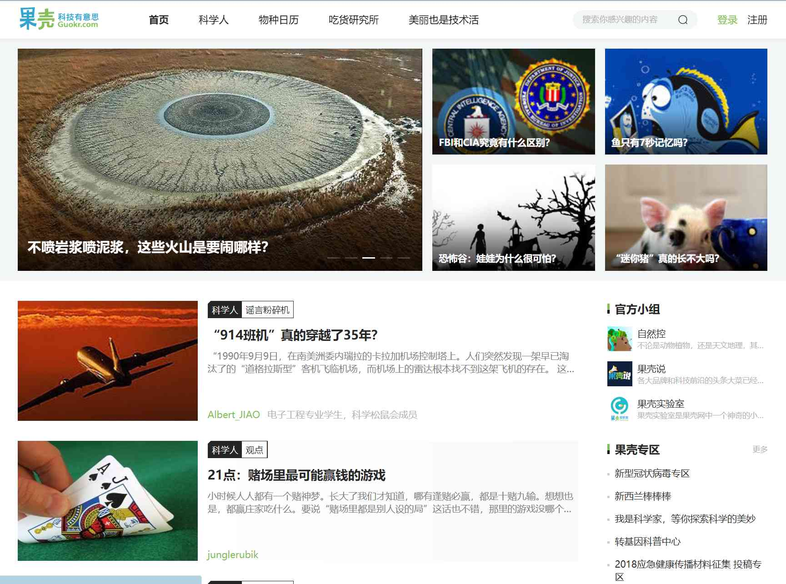

# 新闻

现在随着网络技术迅速的发展，加上手机的广泛普及，无论在世界的哪一个角落发生什么，只要大家还在同一个地球村，都能够迅速的了解到发生了什么，因为每个人的手机上都安装了各种各样的新闻app，有什么新闻都会随时推送给你。那么多的新闻app每一个都下载似乎会很累赘，所以今天给大家推荐几个集各种新闻消息于一体的一些网址供大家使用(后续也会慢慢增加)：

###今日热点：
###<https://tophub.today>

网站上基本上涵盖了你手机上安装的所有有关新闻类的app，推送的消息也基本上都是一些热门，每天上班打开电脑可以先通过他来全方位了解一下各个行业的消息，阅读起来还算方便​。同时他还有他自己啊app名字就叫“今日热点”，需要的也可以从应用商店下载。​

### 7*24小时全球实时财经新闻直播
###<http://finance.sina.com.cn/7x24>.

新浪财经的一个实时新闻网址，“坚持做最好的财经直播报道，给百姓最真的财经动态”。有比较关注国际新闻，财经新闻或者比较关注股市或者有购买基金投资什么的小伙伴可以关注一下，同时也可以下载他的一个手机客户端“新浪财经”，跟这个消息基本上是统一的，可靠及时可以拥有。

### 煎蛋：
###<http://jandan.net>

也是一个挺有趣的信息网站，会有好多人投稿去分享一些科普或者小故事类的新闻跟故事，虽然有贴吧或者微博之类的地方，但是那几个地方说实话太咋，太乱啥都有，在这里或许你能发现不一样的故事和收获。

### 果壳<科技有意思>：
###<https://www.guokr.com>

这个基本上就纯是一个给科普的了，涉猎了很多领域，也很有意思，大家可以看一下，应该比刷抖音或者快手可能有新引力(只不过没有漂亮的小姐姐)，但是你可以通过你了解的知识，去给你的小姐姐去科普哦，这样啥都有了ε=(･д･｀*)ﾊｧ…

### readhub：
###<https://readhub.cn/topics>

也是一个按照时间线实时更新一些时下的热门动态和话题，大多数属于科技公司相关的消息类等，还有一个小程序可以直接扫描后再手机上使用，页面很简洁使用起来也挺方便。

 
### 广告人的网址导航：
###<https://www.addog.vip/>

从图中也能看出该网站涵盖了很多领域和功能，但他的标语是广告人的网址导航，所以网站上列出的也基本上都是一些广告策划的文案、工具、动态、平台等。大家有什么好的创意或者想参考什么模板的话，可以借鉴一下。
 
### 知微事见：
###<https://ef.zhiweidata.com/>

 很有科技范的网站，通过图表统计来很直观的展示过去24小时内的热门新闻和消息并且还统计了新闻的关注热度以及舆论占比度（包括时间热度，热点所属行业，事件影响力，事件参与媒体情况等）还可以通过传播趋势分析，渠道分析，舆论媒体和参与人群等各个方面来分析当前热点的情况，总之通过它可以准确的给你分析去当前热点的来龙去脉。
 

