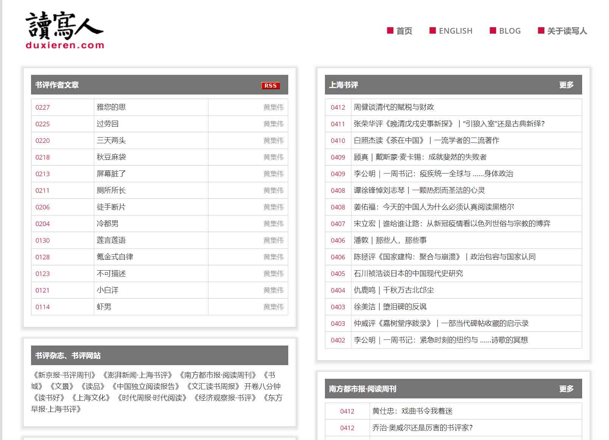

# 生活

### Firefox Monitor网址：https://monitor.firefox.com

该网站可以让你检测你现在的邮箱是否安全，建议可以做下测试，我简单做了一下，效果见图2！

​	在这个信息网络发达的时代，在生活中肯定会遇到过各种需要你注册填写个人信息的场景，相信大家都会经常收到一些推销或者广告甚至诈骗电话等，而且他们还很清楚你的所有信息并且是完全正确的。这就是我们常说的，在这个大数据时代也许统计数据和代码程序比你自己还要了解你自己，也许这就是社会发展的必然性，但是事物的产生就会有利又有弊。因此就造成了我们的各种隐私数据被人非法泄露，然后又有人非法获得给我们造成变相的安全隐患和经济损失。所以大家可以通过上面这个地址做一下简单的测试，可以提前做一下预防和处理有备无患

### 下厨房：<http://www.xiachufang.com>

​	哈哈哈，生活必备哦，特别是持家的男人呢！这个必须值得收藏，都说抓住男人的嘴就能抓住他的人，其实女人的嘴更容易抓住，有事没事就给你的她做顿大餐，做点好吃的，可能更有利于促进双方的感情呢，如果你还是个单身狗的话，那就更应该收藏一下了，万一哪天小姐姐说想尝尝你的手艺，你总不能说咱们订外卖吧，那这到手的小姐姐可就又飞走了哦！哦！哦！

​	在这上面基本上都是一些厨艺精湛的高手们分享的美食教程，图片文字视频什么的都有，解说都很清楚，值得学习。

### 读写人：<http://www.duxieren.com>

喜欢文学的读书的小伙伴，可以入这个坑，还是蛮有深度的。

“读写人”（duxieren.com）是一个聚合了书评杂志、书评博客、中英文读书资源的读书网站。

### 蜂鸟网：<http://www.fengniao.com>

一个比较专业的摄影网站，你可以上传分享你的一些专业摄影，也可以下载学习他人的作品，还有一些相关的教程和摄影相关的技术和设备等。我虽然不太玩这个，但是业界却有句话，’玩单反穷三单‘哈啊哈，足以说明玩单反的都是富人啊哈哈！大家根据自己需要。
