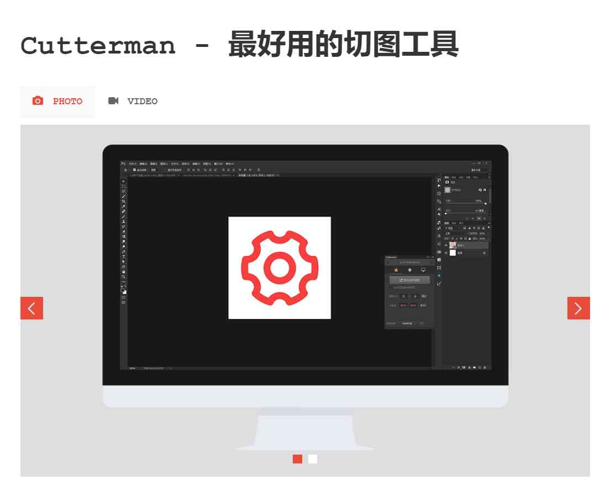
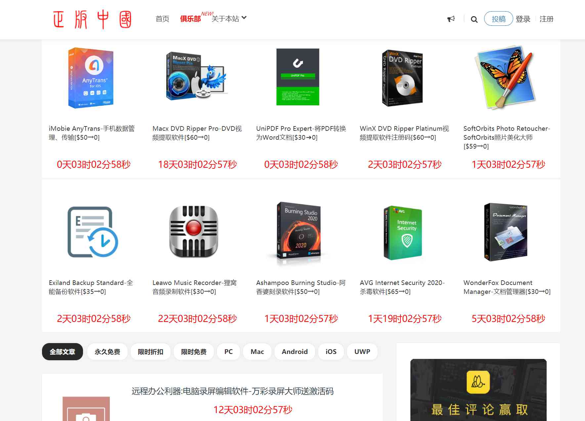

# 软件

好的工具软件能帮你提高工作效率，甚者还有助于你的日常生活和活动，毕竟工欲善其事必先利其器。

先给大家分享一些下载软件比较靠谱的网址(后续也会再增加，或者有好的软件，我会直接分享给大家)：

#### xclient：<https://xclient.info>

如果你是工作狂，这上面的大部分软件基本能满足你的所有需求，无论你是开发，设计，视频，办公，运维，广告还是其他的行业，基本在这里都有了。

### cutterman：<http://www.cutterman.cn/zh/cutterman>

这个小插件做过设计，用过ps的小伙伴应该都不陌生，比起以前要靠手动去切图，这个插件简直不能再好用了，可以一键导出包括手机(安卓，ios)，web三端不同比例的切图，谁用谁说好。（解放双手，升职加薪就靠它了）

### 正版中国：<https://getitfree.cn>

这里的软件大部分也都是些很专业的软件，他上面经常有一些限时免费开放的软件，大家可以根据自己需要，择时下载你需要的。
