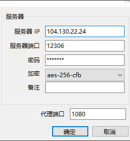

#软件使用
  ##v2ray
    https://toutyrater.github.io/prep/install.html 
    https://github.com/233boy/v2ray/wiki/V2Ray%E4%B8%80%E9%94%AE%E5%AE%89%E8%A3%85%E8%84%9A%E6%9C%AC 

==========================================================
  ##Nginx
  一、启动

     cd usr/local/nginx/sbin
     ./nginx
  二、重启
    
    更改配置后重新加载配置
    先判断配置文件是否正确​   

    nginx -t -c /usr/local/nginx/conf/nginx.conf
    或者
    cd /usr/local/nginx/sbin
    先./nginx -t或者nginx -t
    后./nginx -s reload 或者 service nginx reload
    如果有报错​   

    nginx: [error] open() "/usr/local/nginx/logs/nginx.pid" failed (2: No such file or directory)
    使用nginx -c的参数指定nginx.conf文件的位置
    /usr/local/nginx/sbin/nginx -c /usr/local/nginx/conf/nginx.conf
  三、关闭
    
    查询nginx主进程号
    
    ps -ef | grep nginx
    
    从容停止 kill -QUIT 主进程号
    
    快速停止 kill -TERM 主进程号
    
    强制停止 kill -9 nginx
    
    若nginx.conf配置了pid文件路径，如果没有，则在logs目录下
    
    kill -信号类型 '/usr/local/nginx/logs/nginx.pid'
    
==========================================================
  ##myComputer
   ###node
    node 目录
    node: /usr/bin/node /usr/local/bin/node /usr/local/application/nodeJs/bin/node

   ###jenkins
    jenkins配置目錄
    /etc/sysconfig/jenkins
     
    jenkins项目地址I
    /var/lib/jenkins/workspace/super/client/dist
    /var/lib/jenkins/workspace/superServer/server
    /var/lib/jenkins/workspace/mango/_book;
    
    jenkins重启
    http://localhost:8080/restart 
    http://localhost:8080/reload 
    service jenkins start
    service jenkins restart
    service jenkins stop

   ###forover
   
    forever默认安装位置在/usr/bin下
    forever start app.js
    //关闭命令
    forever stop app.js
    //重启命令
    forever restart app.js

==========================================================
   ###nginx
    /usr/local/nginx
   ###在jenkins中部署工程时进行构建的处理
        #!/bin/bash -ilex  这个可以获取所有的权限
        cd server 
        #bash reload.sh
        ssh -l root 123.206.62.148 'cd /var/lib/jenkins/workspace/superServer/server; ./reload.sh'  以root的身份执行sh文件
        
        cp /var/lib/jenkins/workspace/superServer/server/reload.sh /var/lib/jenkins/workspace/mango/reload.sh  copy文件
        
        ssh -l root 123.206.62.148:65534 'cd /var/lib/jenkins/workspace/mango; ./reload.sh'
        #!/bin/bash -ilex
        /var/lib/jenkins/workspace/mango/reload.sh
        
        gitbook -V
        #ssh -l root 123.206.62.148 -p 65534 "/var/lib/jenkins/workspace/mango/reload.sh"
        
        ln -s /usr/local/application/nodeJs/bin/gitbook /usr/local/bin/gitbook    
        把gitbook加到环境变量中要不在jenkins中构建部署执行shell时，会失败
        
        setsid gitbook serve  启动gitbook并保持不停止
        
==========================================================
   ###docker
   >安装docker-ce
   1、安装依赖  docker依赖于系统的一些必要的工具，可以提前安装。
    
    yum install -y yum-utils device-mapper-persistent-data lvm2
   >2、添加软件源
   
    yum-config-manager --add-repo http://mirrors.aliyun.com/docker-ce/linux/centos/docker-ce.repo 
   >3、安装docker-ce
   
    yum clean all yum makecache fastyum -y install docker-ce
   >4、启动服务 
    
    通过systemctl启动服务
    
    systemctl start docker
   >5、查看安装版本
    
    这样子就安装成功了，启动服务以后可以使用docker version查看一下当前的版本。
    docker version
    Client:Version: 18.09.2 API version: 1.39 Go version: go1.10.6 Git commit: 6247962 Built: Sun Feb 10 04:13:27 2019 OS/Arch: linux/amd64 Experimental: falseServer: Docker Engine - Community Engine: Version: 18.09.2 API version: 1.39 (minimum version 1.12) Go version: go1.10.6 Git commit: 6247962 Built: Sun Feb 10 03:47:25 2019 OS/Arch: linux/amd64 Experimental: false
   >安装 Shadowsocks
    拉取docker-shadowsocks镜像
    
    安装的过程非常简单，只需要一个命令就可以，命令中有两个参数可以自修改，-p是设置shadowsocks的服务器端口号，-k是设置自己的密码
    命令：
    docker run -d --name shadowsocks -p 12306:12306 oddrationale/docker-shadowsocks -s 0.0.0.0 -p 12306 -k 0000 -m aes-256-cfb
    
    使用docker ps来来查看是否安装成功：
     docker ps                                                                                                                        
    CONTAINER ID        IMAGE                             COMMAND                CREATED                  STATUS              PORTS                            NAMES
    1016c8cc0ce4        oddrationale/docker-shadowsocks   "/usr/local/bin/ssse   Less than a second ago   Up 22 seconds       104.130.22.24:12306->12306/tcp   2ede2591-1ec0-4c2b-a3ef-59697ff02ba7-n1/shadowsocks   
    b47dd901c3dd        carina/consul                     "/bin/consul agent -   5 hours ago              Up 5 hours                                           2ede2591-1ec0-4c2b-a3ef-59697ff02ba7-n1/carina-svcd
    可以看到shadowsocks服务已经在运行了。
   >使用shadowsocks连接服务器
    
    （1）选在windows的 Shadowsocks客户端 ，解压到任意的目录下，运行
    （2）添加shadowsocks的服务器的ip和端口号、密码，点击确定就可，其中服务器ip填你所购买的服务器的ip地址，端口号和密码填你上面设置的。
   
   
    （3）右键点击任务栏中shadowsocks.exe的图标，勾选“启用系统代理”。
    （4）打开任意浏览器，即可自由上网 
==========================================================
   ### IDEA
   ##### 插件
    智能代码提示：codota，
    快捷键提示：Key-Promoter-X，
    lombok-plugin，
    MavenRunHelper，
    将json转换为模型对象：RoboPOJOGenerator，
    项目类型统计：Statistic
    
==========================================================
   ###谷歌浏览器
   ####浏览器插件 
    插件位置 C:\Users\syy\AppData\Local\Google\Chrome\User Data\Default\Extensions
    格式crx或者zip
   >Tablist

    查看打开的所有网页链接一键复制或者选择复制
   > adblock

    在YouTube、Facebook、Twitch和其他你喜爱的网站上拦截广告和弹窗。
   >idm

    一个页面集成下载器需要配置idm的一个下载软件
   >JSONView

    查看页面json文件格式化
   >OneTab

    节省高达95％的内存，并减轻标签页混乱现象
   >捕捉网页截图

    捕捉网页截图，编辑并将它们保存为PDF，JPEG，GIF，PNG或BMP；上传，打印，在Photoshop中打开，复制到剪贴板或电子邮件
   >极简图床

    帮你快速下载页面中的图片，可以帮你把页面的所有图片识别出来，然后你根据需要选择相应的一键批量下载 
   ###火狐浏览器
   ####浏览器插件 
    插件位置 C:\Users\syy\AppData\Roaming\Mozilla\Firefox\Profiles\noyseqwz.default-release\extensions
    格式xpi
    
========================================================== 
   ###从HTTP响应头看各家CDN缓存技术    
   由于国内各家电信运营商互联互通的壁垒，CDN作为互联网用户加速的最后一公里，扮演了很重要的角色。
   
   在各家公司大谈的异地多活容灾上也承担了用户分流的重任，看看各家用的东西，结合一些网上的公开资料，也能管中窥豹。

   传统的国内CDN厂家有：帝联，网宿，蓝汛，快网等
   
   新兴的互联网公司有自家产品对外输出型和创业公司细分型：BAT都有此产品，还有七牛，又拍，微软azure等
   
   美国龙头：Akamai，美国市场大哥，Apple用的也是这个，但Apple的在线服务这么烂，真怀疑是不是Apple把Akamai带坑里了。

   >如果我们使用了阿里云的CDN服务，那么请求的资源Header头部就会包含X-Swift-SaveTime、X-Swift-CacheTime、Age这三个字段信息，很多同学不清楚它们都代表什么意思？

   >X-Swift-SaveTime
   
    X-Swift-SaveTime 代表开始在cdn上缓存的时间，如果字段值是2018-07-11 14:33:49，由于时间是GMT时间，折算成北京时间加8小时，也就是代表该资源在2018-07-11 22:33:49开始在CDN缓存。
   >X-Swift-CacheTime
   
    X-Swift-CacheTime 是cdn默认缓存时间，以秒为单位，过了这个时间该缓存就失效了。比如86400意思是缓存24小时，超过了这个时间，该缓存就丢弃了，需要重新回源获取。
  
   >Age
   
    Age 代表在cdn上已经缓存的时间，以秒为单位。如果值是200，那么就代表该资源已经在cdn缓存了200s，您可以结合X-Swift-SaveTime的值和自己的电脑时间比对下。

   >淘宝
   
       server:Tengine
       status:200
       timing-allow-origin:*
       via:cache15.l2et15-1[0,200-0,H], cache35.l2et15-1[0,0], cache3.cn286[0,200-0,H], cache8.cn286[11,0]
       x-cache:HIT TCP_MEM_HIT dirn:20:727080716
       x-swift-cachetime:31535998
       x-swift-savetime:Fri, 19 Aug 2016 02:55:13 GMT
       不用说，淘宝用的是自家阿里CDN， 走Tengine， 返回的响应很友好，甚至告诉你是从内存命中的。
       x-swift指明了使用了的具体热点缓存技术。
   
       via:cache46.l2et2[0,200-0,H], cache60.l2et2[0,0], cache7.cn286[0,200-0,H], cache8.cn286[3,0]
       x-cache:HIT TCP_HIT dirn:11:60349972
       x-swift-cachetime:31535950
       x-swift-savetime:Tue, 28 Jun 2016 04:04:29 GMT
       根据阿里云官网解释：
       若：X-Cache:HIT TCP_MEM_HIT 表示命中缓存
       若：X-Cache:MISS TCP_MISS 则表示未命中缓存
   
   >微信
    腾讯CDN节点：
   
       Server:Qnginx/1.1.1
       X-Cache-Lookup:Hit From Disktank
       X-NWS-LOG-UUID:406395d0-7cb8-4630-99cf-8208d04e7750
       很明显，这里告诉大家CDN命中了磁盘缓存上的数据。
       一些网上资料查到的解释：
       X-Cache-Lookup:Hit From MemCache 表示命中CDN节点的内存
       X-Cache-Lookup:Hit From Disktank 表示命中CDN节点的磁盘
       X-Cache-Lookup:Hit From Upstream 表示没有命中CDN
        
       
       腾讯还与小米合作，在硬盘版小米路由上推出了一个插件，叫腾讯会员兑换，本质上就是利用小米路由用户上的硬盘存储一部分内容，上传给需要用的用户，由腾讯计算收益，盘活了家里闲时的网络资源。
   
   >网易云音乐
   
       Server:nginx
       X-Via:1.1 ngdianxin90:9 (Cdn Cache Server V2.0)
       网易太低调，最近也开始搞网易云产品了，但基本查不到什么公开资料，从响应头看似乎就是直接用的nginx。
   
   >新浪微博
   
       Content-Type: image/gif
       SINA-LB: aGEuNDEuZzEuc2h4LmxiLnNpbmFub2RlLmNvbQ==
       SINA-TS: ZGFkYzk4Y2UgMCAwIDAgOCAwCg==
       Via: http/1.1 ctc.ningbo.ha2ts4.70 (ApacheTrafficServer/4.2.1.1 [cRs f ])
       X-Via-CDN: f=Edge,s=ctc.ningbo.ha2ts4.70,c=115.231.82.33
       Age: 1
       X-Via: 1.1 zjjhdx33:3 (Cdn Cache Server V2.0), 1.1 tzhoudxin37:5 (Cdn Cache Server V2.0)
       Connection: keep-alive
       这个返回了Cdn Cache Server V2.0，有多家公司都返回了这个，不知道这是个啥玩意，是不是个开源通用产品呢？Squid Varnish Nginx？
   
   >segmantfault：
    命中
   
       via:T.101203.R.1, M.ctn-zj-lna-204
       x-cache:HIT(R) from ctn-zj-lna-204
       x-request-id:c239b9ae8ec9f83030bbdfaabcfa8fb4
       x-source:U/200, G/200
       缓存MISS
       
       via:T.101195.N.1, T.101163.R.1, V.mix-hz-fdi-163, M.ctn-zj-lna-200
       x-cache:MISS(S) from ctn-zj-lna-200
       x-request-id:724565e217e01e9f60e9f1b74aecedb3
       在ctn-zj-lna上缓存没有命中,这个ctn-zj是个CDN集群么？
   
   >七牛
    访问该图片:http://7xt44n.com2.z0.glb.qin...
    Response header返回：
   
       X-Log:mc.g;IO:1/304
       X-Qiniu-Zone:0
       X-Reqid:90oAABxCoNMaw2wU
       X-Via:1.1 dxxz44:2 (Cdn Cache Server V2.0), 1.1 ngdianxin42:6 (Cdn Cache Server V2.0)
       用的就是自家产品。
   
   >唯品会
       
       Server:vipshop/Vbib
       Transfer-Encoding:chunked
       Vip-Cache:HIT
       x-amz-delete-marker:false
       X-Via:1.1 xxxz53:0 (Cdn Cache Server V2.0), 1.1 zhdx34:6 (Cdn Cache Server V2.0)
       看Server的响应头，似乎也应该是自家搭建的CDN,显示了命中与否。
       
==========================================================
