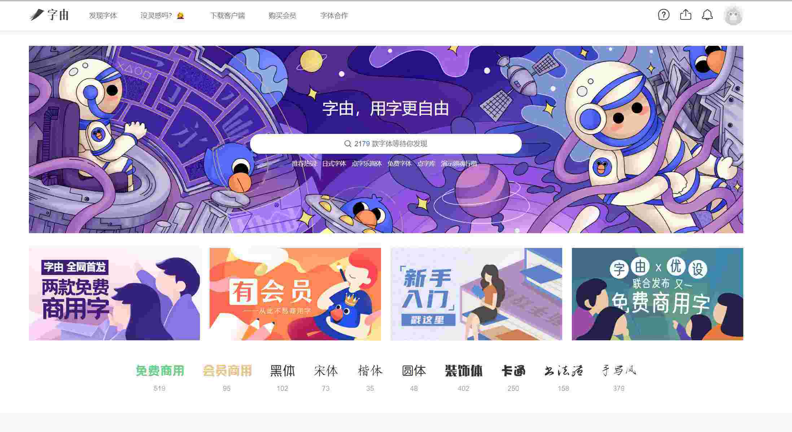
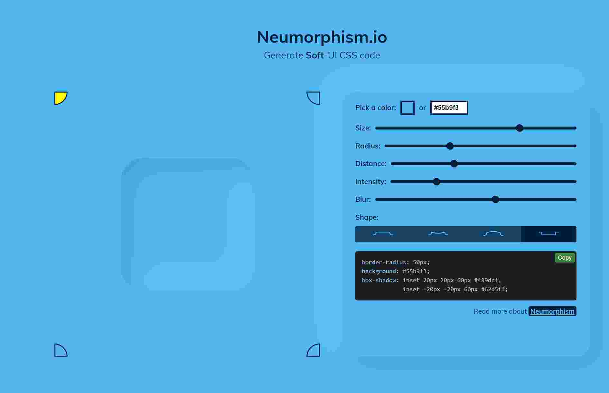
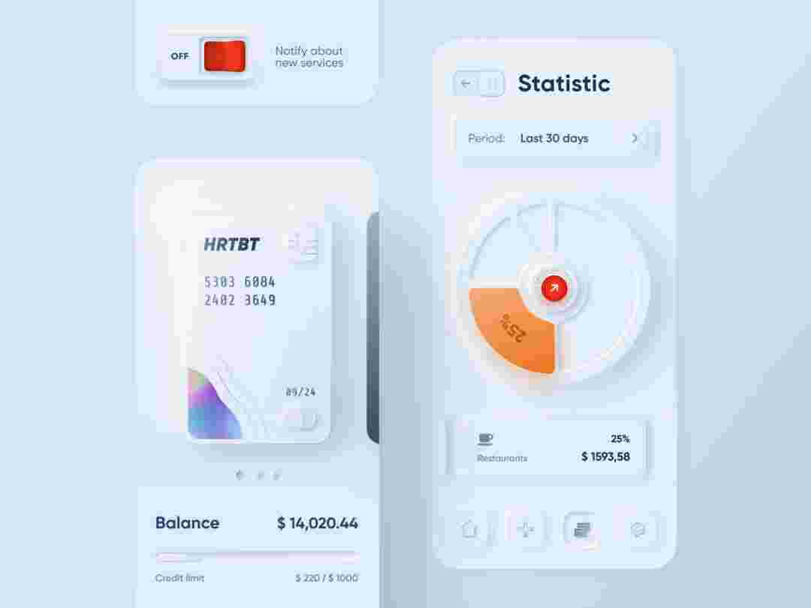
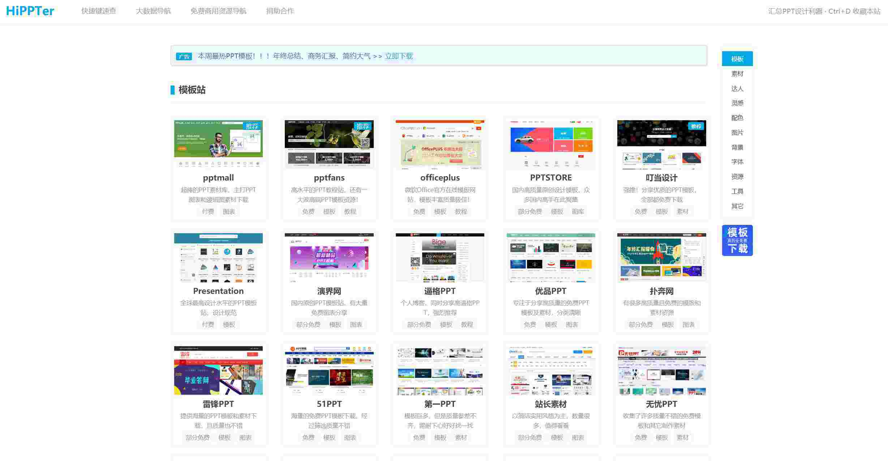
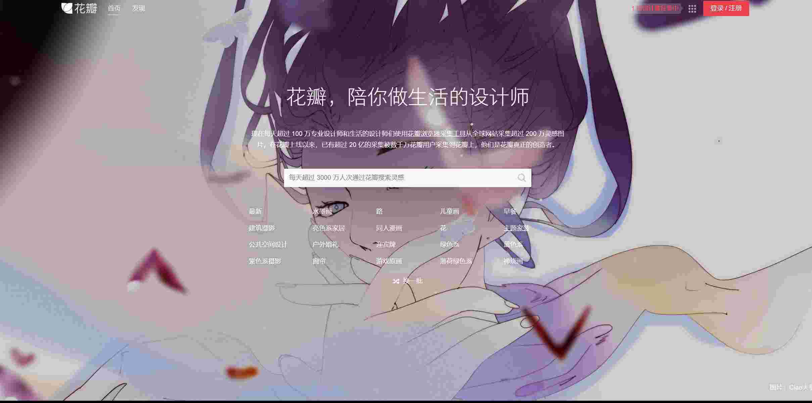

# 工作

### 字由：<https://www.hellofont.cn>

在工作中需要设计的小伙伴看到这个可能会很高兴吧，正如他网站上的‘字由，用字更自由’，毕竟平时的工作设计中，难免会有一些很奇葩的需求，就是要一些奇奇怪怪的字体来体现产品的不同和个性等，所以这个蛮适合平时应对各种设计需求的伙伴。

### 360查字体：<http://fonts.safe.360.cn>

上面设计好了字体，选好了字体，但如果商用的话，大家还需要来看看是否能够进行商用哦，要不然万一也出现字体纠纷可就不好了。

### Neumorphism网址：https://neumorphism.io

通过这个网站可以设计获取一些带阴影效果的样式，可以用到设计或者PPT文案中，可以使你的你的设计很有视觉冲击感，

现在貌似挺流行的一种设计风格新拟态UI设计，上面的网站基本上就是基于这个设计灵感来源然后作者进行开发的。

新拟物化主要是通过阴影来实现的，还原真实的光照场景，一边暗，一边亮。通过，阴影实现凸凹两种质感。

### soft UI <https://uimovement.com>

一个丰富的设计风格网站

### hippter：<http://www.hippter.com>

PPT模板网站，相信大家应该会需要到，上面基本涵盖了所有的行业类型和设计学区。毕竟现在的各行各业，所有的职业基本上都会有要做演讲做设计，从大学毕业的毕业设计，到产品的发布会，到就职报告，到年中总结大会，再到各种大型的会议基本上现在都会用到PPT，所以一个能吸引所有人眼球的PPT设计就已经能够给你带来百分之五十的胜利哦。剩下的那百分之五十就靠你自己了。

### 花瓣：<https://huaban.com>

花瓣网，对于设计师们来说也是不陌生的。众多设计师的灵感来源地，在这里你即可以上载你的作品，跟大家分享而且还能产生客观的收益，同时你可以下载他人的作品来参考学习，集众多精华于一身。多余的就不介绍了，需要或者感兴趣的大家可以去拜访。

### IMGBIN网址：https://imgbin.com

一个免费的jpg图片资源网站，差不多是啥图啥资源都有，基本能满足你的所有需求，很实用，你可以直接用在你的设计或者PPT中，可视效果非常完美。
